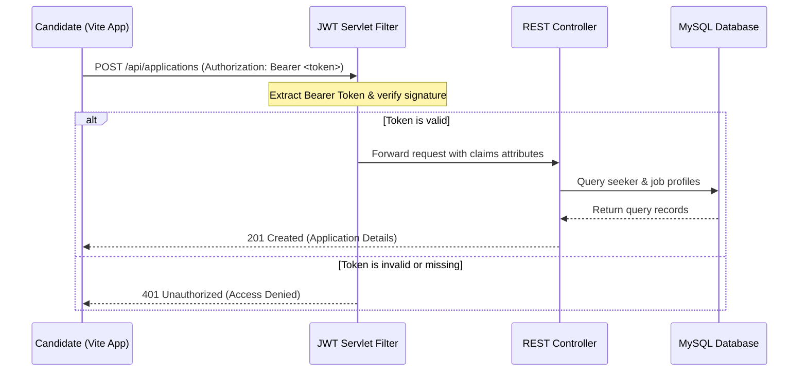

# DevHire

**DevHire** is a premium, full-stack job portal designed specifically to connect software developers with tech recruiters. The application features robust security, responsive glassmorphism UI design, and modular service-oriented backend services.

---

## Tech Stack

- **Backend:** Java 21, Spring Boot, Hibernate ORM, JPA, Jakarta Servlet Filter
- **Security:** JWT (JSON Web Tokens) Authentication, custom Secure Password Hashing (SHA-256)
- **Database:** MySQL 8.0, custom relational constraints (`ON DELETE CASCADE`)
- **Frontend:** React 19, TypeScript, Vite, Vanilla CSS (harmonious HSL custom dark/light palettes)

---

## Key Features

- **Double-Sided User Roles:** Distinct features and dashboards for **Candidates (Seekers)** and **Recruiters**.
- **Interactive Job Search:** Search jobs by keywords, locations, or key technical skill tags.
- **Secure Authentication:** JWT-based stateless authentication protecting developer profile states.
- **JWT Servlet Filter Interceptor:** Intercepts request headers to automatically validate authorization states on protected resources.
- **Recruiter Workflows:** Create, edit, publish job listings, and review incoming candidate cover notes and profile information.
- **Seeker Workflows:** Review job requirements, apply to open roles, and track application history states (`APPLIED`, `SHORTLISTED`, `REJECTED`, `HIRED`).
- **Responsive Premium Design:** Sleek modern typography, smooth micro-animations, glassmorphism overlays, and harmony styling.

---

## Advanced Architecture & Security



---

## Local Setup & Run Instructions

### Prerequisites
- **Java JDK 21+** installed
- **Node.js v18+** & npm installed
- **MySQL Server 8.0** running locally

### Database Setup
1. Log in to your MySQL terminal and run the [schema.sql](src/main/resources/schema.sql) script:
   ```bash
   mysql -u root -p < src/main/resources/schema.sql
   ```
   *This automatically creates the `devhire` database and tables.*

### Running the Backend (Spring Boot)
1. Open [application.properties](src/main/resources/application.properties) and specify your MySQL credentials, or set them as environment variables:
   ```bash
   # On Windows (cmd)
   set DB_USER=root
   set DB_PASSWORD=yourpassword
   ```
2. Build and launch the Spring Boot backend server:
   ```bash
   ./mvnw clean compile
   ./mvnw spring-boot:run
   ```
   *The backend starts running on `http://localhost:8080`.*

### Running the Frontend (React + TS)
1. Navigate to the `frontend` folder:
   ```bash
   cd frontend
   ```
2. Install npm dependencies and start Vite:
   ```bash
   npm install
   npm run dev
   ```
   *The frontend starts running on `http://localhost:5173`.*

---

## API Endpoints

| Endpoint | Method | Security | Description |
| :--- | :--- | :--- | :--- |
| `/api/auth/register` | `POST` | Public | Create new Seeker or Recruiter user |
| `/api/auth/login` | `POST` | Public | Authenticates user and returns JWT token |
| `/api/jobs` | `GET` | Public | Fetch all open job postings |
| `/api/jobs/{id}` | `GET` | Public | Fetch job details |
| `/api/jobs` | `POST` | JWT (Recruiter) | Create new job post |
| `/api/jobs/recruiter/{id}` | `GET` | JWT (Recruiter) | Fetch active jobs posted by a recruiter |
| `/api/applications` | `POST` | JWT (Seeker) | Apply for a job |
| `/api/applications/seeker/{id}`| `GET` | JWT (Seeker) | Seeker application history |
| `/api/applications/recruiter/{id}`| `GET` | JWT (Recruiter) | Recruiter received applications |
